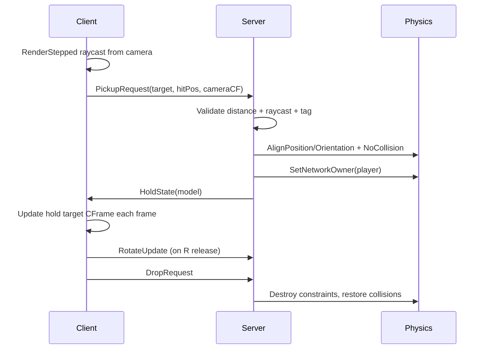

# First-Person Object Pickup & Inspection System

A production-ready, modular Roblox pickup system inspired by **A Dusty Trip** and **My Summer Car**. Pick up Blender-imported models, hold them in first person, inspect them with mouse rotation, and drop them with smooth physics.

## Features

- Frame-perfect camera-center raycasts (`workspace:Raycast`)
- `CollectionService` tag (`Interactable`) or `Pickupable` attribute detection
- Server-validated pickup range and line-of-sight checks
- Modern `AlignPosition` + `AlignOrientation` constraints (no deprecated `BodyPosition` / `BodyGyro`)
- Network ownership transferred to the holding player for zero-lag physics
- Collision isolation between held objects and the holder (walls still collide)
- Blender pivot correction via bounding-box / model pivot analysis

## Controls

| Key | Action |
|-----|--------|
| **E** | Pick up targeted object / drop while holding |
| **R** (hold) + mouse | Rotate held object for inspection |
| **G** | Drop held object |

## Project Structure

```
src/
├── ReplicatedStorage/PickupSystem/
│   ├── Config.luau           # Tunable constants
│   ├── PhysicsUtility.luau   # Pivot math, constraints, collision helpers
│   └── Remotes.luau          # RemoteEvent factory
├── ServerScriptService/PickupSystem/
│   └── PickupController.server.luau
└── StarterPlayer/StarterPlayerScripts/PickupSystem/
    └── PickupController.client.luau
```

## Installation (Rojo)

1. Install [Rojo](https://rojo.space/) and sync this repository into your place:
   ```bash
   rojo serve
   ```
2. Connect from Roblox Studio with the Rojo plugin.
3. Ensure your experience uses a **first-person camera** (or a custom camera script that sets `workspace.CurrentCamera`).

## Making Objects Pickupable

Tag or attribute any `Model`, `MeshPart`, or `BasePart`:

**Option A — CollectionService tag (recommended)**

1. In Studio: **Tag Editor** → create tag `Interactable`
2. Apply the tag to your imported Blender model (or individual mesh)

**Option B — Attribute**

Set on the model or part:

```
Pickupable = true   (boolean)
```

### Blender Import Tips

- Import as a `Model` when possible; lone `MeshPart` instances are auto-wrapped on the server.
- Irregular pivots are handled automatically: the system uses `Model:GetPivot()` or `GetBoundingBox()` to place attachments at the visual center of mass.
- Assign a `PrimaryPart` in Studio for best results (optional — largest part is auto-selected).

## Architecture



## Configuration

Edit `src/ReplicatedStorage/PickupSystem/Config.luau`:

| Setting | Default | Description |
|---------|---------|-------------|
| `MAX_PICKUP_DISTANCE` | 12 | Max raycast pickup range (studs) |
| `HOLD_DISTANCE` | 4.5 | Distance in front of camera while held |
| `ROTATION_MOUSE_SENSITIVITY` | 0.004 | Inspection rotation speed |
| `ALIGN_POSITION_RESPONSIVENESS` | 200 | Hold smoothness vs snappiness |

## Security

The server re-validates every pickup:

- Target must be in `workspace` with `Interactable` tag or `Pickupable` attribute
- Hit position must be within `MAX_PICKUP_DISTANCE` of the character
- Client camera position must be near the character head
- Server performs its own raycast to confirm line-of-sight to the object

## Requirements

- Roblox Studio (modern Luau)
- Optional: Rojo for file sync
- First-person camera setup in your game

## License

Use freely in your Roblox projects.
